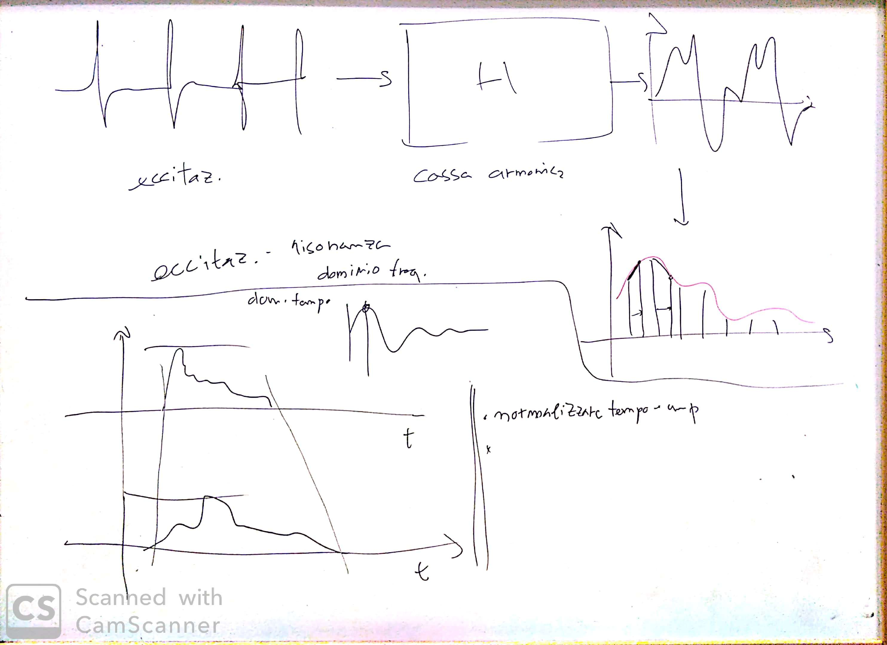

# Lezione di martedì 21 gennaio 2020

## Argomenti

* Analisi similitudini tra suoni brano acusmatico e strumenti a percussione
  * similitudini morfologiche
    * estrazione dell'inviluppo
    * correlazione dell'inviluppo
  * similitudini spettrali
    * modello *linear-predictive*: separazione in eccitazione e risonanza
    * estrazione dell'inviluppo spettrale

## Lavagne

